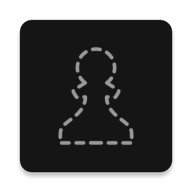

  

# Blindfold Chess
Blindfold Chess is a non-profit open source Android app for helping you train your blindfold chess skills.

It is designed in such a way that you can use it with your eyes closed.
The app has multiple modes such as "Guess the square color" and "Is the move legal" where they have two yes/no buttons at the top and at the bottom of the screen.
The core idea of the app is to simulate being blindfolded which lets the user focus on their board vision instead of the app's UI.

## Screenshots

